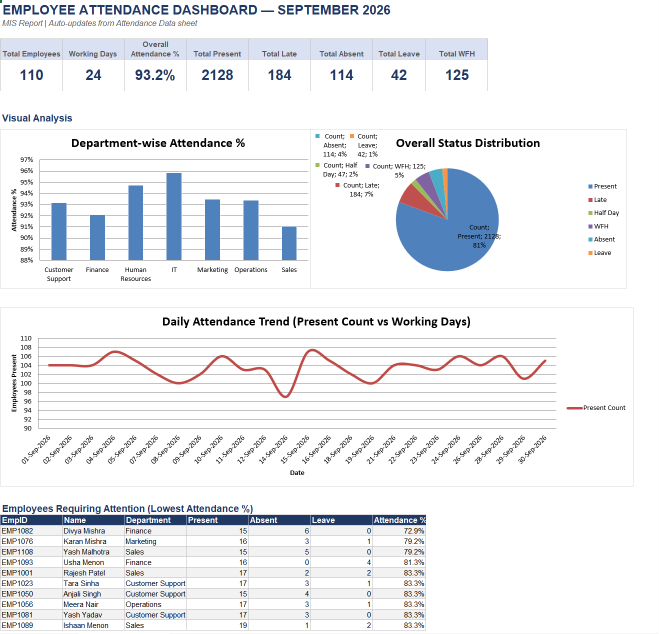

Employee Attendance Dashboard

An interactive Excel-based Employee Attendance Dashboard developed for MIS reporting and workforce attendance analysis.

📌 Project Overview

This project analyzes employee attendance data and converts raw attendance records into an interactive management dashboard.

The dashboard provides a consolidated view of attendance KPIs, employee performance, attendance status, and visual trends.

Tools & Technologies

- Microsoft Excel
- Advanced Excel
- Pivot Tables
- Excel Formulas
- Data Cleaning
- Data Analysis
- KPI Reporting
- Dashboard Development
- Data Visualization
- MIS Reporting

Dashboard KPIs

The dashboard tracks key attendance metrics including:

- Total Employees
- Working Days
- Overall Attendance %
- Total Present
- Total Late
- Total Absent
- Total Leave

Dashboard Analysis

The dashboard provides visual analysis of:

- Employee attendance performance
- Attendance status distribution
- Present vs. absent trends
- Late attendance
- Leave patterns
- Employee-level attendance summary

Workbook Structure

The Excel workbook contains the following sheets:

| Sheet | Purpose |
|---|---|
| Dashboard | Interactive attendance dashboard and KPIs |
| Cover | Project information |
| Employee Master | Employee master data |
| Attendance Data | Detailed employee attendance records |
| Employee Summary | Employee-level attendance analysis |
| Chart Data | Data used for dashboard visualizations |

Key Business Use Cases

This dashboard can help HR and management teams:

- Monitor overall employee attendance
- Identify attendance trends
- Track late and absent employees
- Analyze leave patterns
- Compare employee attendance performance
- Generate management-level MIS reports
- Support workforce planning and decision-making

Dashboard Preview

Project Files

**Employee_Attendance_Dashboard.xlsx**  
Complete Excel workbook containing the dashboard, source data, calculations, and analysis.

Author

Adarsh Tiwari

MBA – Business Analytics & Marketing

GitHub: [Adarsh-2110](https://github.com/Adarsh-2110)
